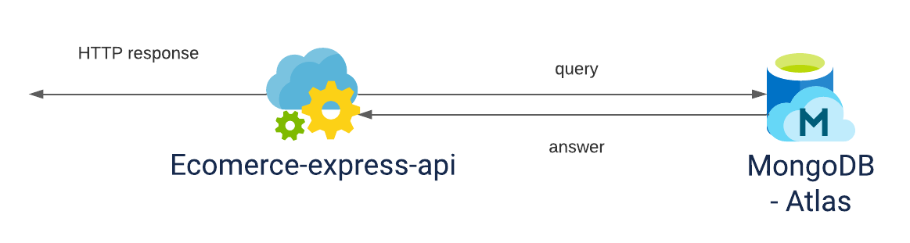

# Ecomerce express API

Node MongoDB eCommerce Rest API using Stripe payment method. Node.js (Express) shopping API with users type authentications.

## 🔨 Resources

☁️ URLs:

- Heroku: xxxxxxxxxxxxxx
- Local: http://localhost:5000/

⚙️ Base dependencies:

- [Express](https://expressjs.com/) (REST framework for nodejs)
- [Nodemon](https://www.npmjs.com/package/nodemon) (NodeJS process manager)
- [JWT](https://jwt.io/) (Standard used to share security information)
- [MongoDB](https://www.mongodb.com/cloud/atlas) (Mongo Atlas Cluster)
- [CryptoJS](https://cryptojs.gitbook.io/docs/) (JavaScript implementations of standard and secure cryptographic algorithms)

## Requirements

- [Node](https://nodejs.org/)
- [Npm](https://www.npmjs.com/) (preferably) or [yarn](https://yarnpkg.com/)

## 🚀 Lift service

### Local environment

You must have the requirements previously installed

In the terminal run the command `npm install` or` yarn` to install the necessary packages, then run the command `npm start` or` yarn start`.

The service will be lifted in http://localhost:5000

### 🔨 Environment File (.env)

    MONGO_URL=[MONGO_URL]
    PASS_SEC=[PASS_SEC]
    JWT_SEC=[JWT_SEC]
    STRIPE_KEY=[STRIPE_KEY]

## 🔧 Tools

### Postman
Download the collection to run tests with postman.

- [Collection](https://www.getpostman.com/collections/835823c885146c162e6f)

## 💻 Endpoints
All exposed endpoints start with `http://localhost:5000/`.

#### Post Requests

    /api/users/register
    /login
    /api/products
    /api/orders
    /api/cart

#### Get Request:

    /api/users
    /api/users/find/:id
    /api/carts
    /api/products
    /api/products?category=category
    /api/orders/income

## Diagramas

    

    
